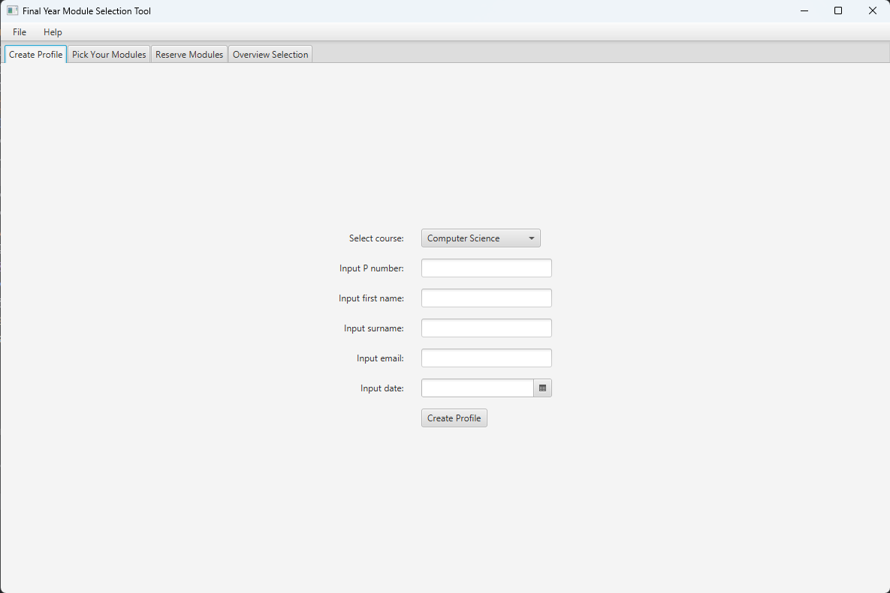
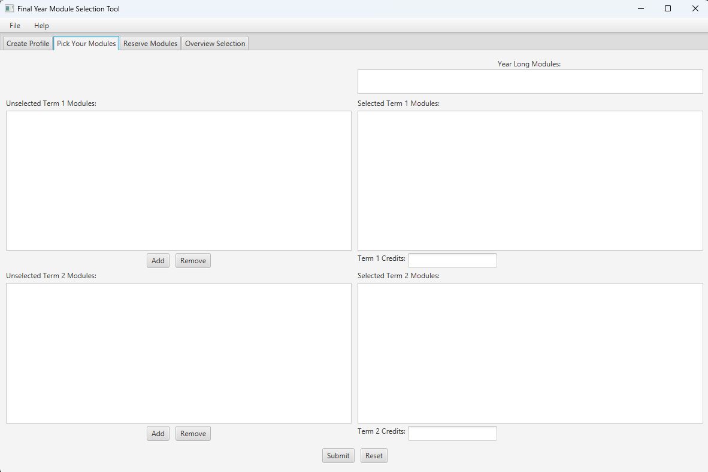
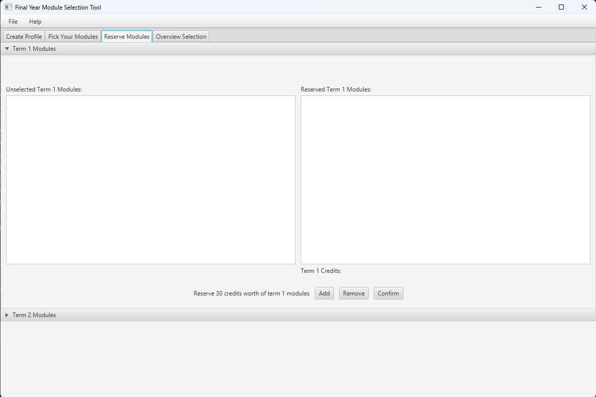
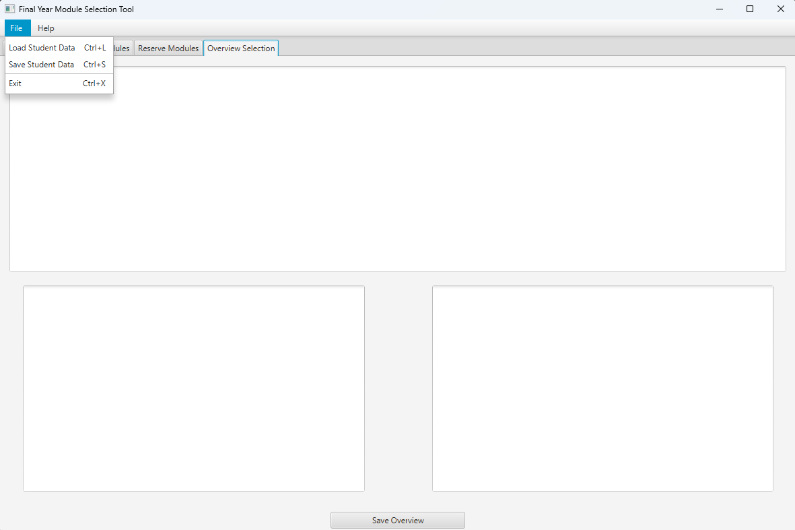
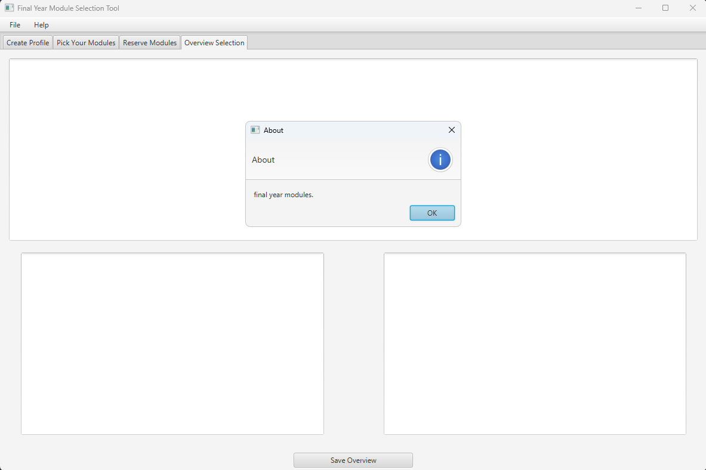

# JavaFX Module Selection Tool GUI

**JavaFX Module Selection Tool GUI** is a desktop application designed for second-year computing students to plan and select their final year modules. The tool provides a structured and interactive experience for managing both mandatory and optional modules while ensuring students meet the credit requirements of their course.

---

## 🚀 Key Features

### 🖥️ JavaFX User Interface
Built using **JavaFX** for a modern, responsive, and interactive graphical user interface.

### 🧠 MVC Architecture
Implements the **Model-View-Controller (MVC)** pattern for a clean separation of concerns and easy maintainability.

### 🎯 Dynamic Event Handling
Custom event handlers ensure the interface dynamically responds to user input and module selections in real time.

### 💾 Data Persistence
Save and load student profiles with **ObjectOutputStream** and **ObjectInputStream**, allowing users to continue their selection process later.

### ✅ Intelligent Validation
Automatically verifies that students meet course-specific module credit rules, including limits on optional modules and total credit thresholds.

### 🔄 Extendability
Easily adaptable for additional courses or changing module structures with minimal code adjustments.

---

## 📱 Screenshots

### Screenshot 1

### Screenshot 2

### Screenshot 3

### Screenshot 4

### Screenshot 5

---

## 🛠 Tech Stack

- **Java 1.8+**
- **JavaFX** (GUI framework)
- **Object Serialization** (for profile saving/loading)
- **MVC Pattern** (clean architecture)

---

## 📌 Use Cases

- Final year module selection for computing students  
- Educational planning software  
- Academic advising and credit tracking tool

